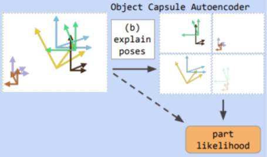

Table of Contents
=================
* [Table of Contents](#table-of-contents)
* [Stacked Capsule Autoencoders (SCAE) in PyTorch](#stacked-capsule-autoencoders-scae-in-pytorch)
* [Results](#results)
* [Usage](#usage)
* [Architecture Summary](#architecture-summary)
  * [Terminology](#terminology)
  * [Part Capsule Autoencoder (PCAE)](#part-capsule-autoencoder-pcae-part_capsule_aepy)
    * [Encoder](#encoder)
    * [Decoder](#decoder)
    * [Loss](#loss)
  * [Object Capsule Autoencoder (OCAE)](#object-capsule-autoencoder-ocae-object_capsule_aepy)
* [Capsules and Semantic Meaning](#capsules-and-semantic-meaning)
  * [Background](#background)
  * [Capsules](#capsules)
  * [SCAE](#scae)
* [Roadmap](#roadmap)
* [Links](#links)
* [Authors](#authors)
* [References](#references)

# Stacked Capsule Autoencoders (SCAE) in PyTorch

Re-implementation of the [SCAE paper](https://arxiv.org/abs/1906.06818) in PyTorch (+ Lightning). Part of a [ML@B](https://ml.berkeley.edu/) in-house research project on semantic meaning in convolutional neural networks.

The official implementation uses Tensorflow 1, Sonnet (for TF1), and relies on parts of `tensorflow.contrib` that are not available in Tensorflow 2. Working with such outdated dependencies is difficult since upgrading any one of these packages usually breaks the entire codebase. Additionally, transitioning all code to the TF2 ecosystem has proven more difficult than a rewrite using modern frameworks.

# Results


[Weights and Biases project](https://wandb.ai/mlatberkeley/semantic-convolutions) hosting runs of both the original Google Research implementation and this Torch port.

- [MNIST run](https://wandb.ai/mlatberkeley/semantic-convolutions/runs/15pg3owa?workspace=user-maximsmol)
- [USPS run](https://wandb.ai/mlatberkeley/semantic-convolutions/runs/1qqxh2ee?workspace=user-maximsmol)

[Weights and Biases report (TODO)](TODO) and the [research presentation](https://docs.google.com/presentation/d/1_ktv4bS8Qdc8CUtQxB6AQTFscjWJ6ePShul85DHfY40/edit?usp=sharing) contain additional results and analysis.

This project was featured in a 10-minute block on [Weights and Biases Salon](https://www.youtube.com/watch?v=RBLzlX0HHQc) as part of the ML@B project showcase for Fall 2020. Included is a summary of the research presentation and Q&A with two of our project members.

# Usage

Run either of the following to install the dependencies:

* `conda env create -f environment.yaml && conda activate scae`
* `pip install -r requirements.txt` (needs Python 3.9)

`train.sh` runs training in deterministic mode with reasonable default hyperparameters. It will log to Weights and Biases in offline mode (it will not ask for an API key or upload anything to the website)

```
usage: scae [-h] [-n BATCH_SIZE] [-N NEPOCHS] [--non-deterministic] [-d] [--model {ccae,pcae,ocae,scae}]
            [--dataset {mnist,usps,cifar10,svhn}] [--data-workers NWORKERS] [--pcae-num-caps PCAE_NCAPS]
            [--pcae-caps-dim PCAE_CAPS_DIM] [--pcae-feat-dim PCAE_FEAT_DIM] [--pcae-lr PCAE_LR] [--pcae-lr-decay PCAE_LR_DECAY]
            [--pcae-lr-restart-interval PCAE_LR_RESTART_INTERVAL] [--pcae-weight-decay PCAE_WEIGHT_DECAY]
            [--pcae-decoder-lr-coeff PCAE_DECODER_LR_COEFF] [--pcae-optimizer {sgd,radam}] [--pcae-lr-scheduler {exp,cosrestarts}]
            [--pcae-loss-ll-coeff PCAE_LOSS_LL_COEFF] [--pcae-loss-temp-l1-coeff PCAE_LOSS_TEMP_L1_COEFF]
            [--pcae-loss-mse-coeff PCAE_LOSS_MSE_COEFF] [--alpha-channel] [--pcae-no-inverse-space-transform] [--ocae-lr OCAE_LR]
            [--log-run-name LOG_RUN_NAME] [--log-project LOG_PROJECT] [--log-team LOG_TEAM] [--log-upload]
            [--log-frequency LOG_FREQUENCY]

Training/evaluation/inference script for Stacked Capsule Autoencoders

optional arguments:
  -h, --help            show this help message and exit
  -n BATCH_SIZE, --batch-size BATCH_SIZE
                        number of samples per mini-batch (default: 128)
  -N NEPOCHS, --num-epochs NEPOCHS
                        number of epochs (default: 3000)
  --non-deterministic   allow non-deterministic operations for potentially higher performance (default: False)
  -d, --debug           enable autograd anomaly detection (default: False)
  --model {ccae,pcae,ocae,scae}
                        part of the model to run (default: pcae)
  --dataset {mnist,usps,cifar10,svhn}
  --data-workers NWORKERS
                        number of data loader workers (default: 12)

PCAE Parameters:
  --pcae-num-caps PCAE_NCAPS
                        number of capsules (default: 16)
  --pcae-caps-dim PCAE_CAPS_DIM
                        number of dimensions per capsule (default: 6)
  --pcae-feat-dim PCAE_FEAT_DIM
                        number of feature dimensions per capsule (default: 16)
  --pcae-lr PCAE_LR     learning rate (default: 0.003)
  --pcae-lr-decay PCAE_LR_DECAY
                        learning rate decay (for exp schedule) (default: 0.998)
  --pcae-lr-restart-interval PCAE_LR_RESTART_INTERVAL
                        number of steps between warm restarts (for cosrestarts schedule) (default: 4000)
  --pcae-weight-decay PCAE_WEIGHT_DECAY
                        weight decay (default: 0.0)
  --pcae-decoder-lr-coeff PCAE_DECODER_LR_COEFF
                        decoder learning rate coefficient (default: 1.0)
  --pcae-optimizer {sgd,radam}
                        optimizer algorithm (default: radam)
  --pcae-lr-scheduler {exp,cosrestarts}
                        learning rate scheduler (default: cosrestarts)
  --pcae-loss-ll-coeff PCAE_LOSS_LL_COEFF
                        log-likelihood loss contribution coefficient (default: 1.0)
  --pcae-loss-temp-l1-coeff PCAE_LOSS_TEMP_L1_COEFF
                        template L1 norm loss contribution coefficient (default: 0.0)
  --pcae-loss-mse-coeff PCAE_LOSS_MSE_COEFF
                        reconstruction MSE loss contribution coefficient (default: 0.0)
  --alpha-channel       whether to add an alpha channel to the part templates (default: False)
  --pcae-no-inverse-space-transform
                        learn part poses in non-inverse transform space (default: False)

OCAE Parameters:
  --ocae-lr OCAE_LR     learning rate (default: 0.1)

Logger Parameters:
  --log-run-name LOG_RUN_NAME
                        W&B run name (default: None)
  --log-project LOG_PROJECT
                        W&B project name (default: SCAE)
  --log-team LOG_TEAM   W&B team name (default: None)
  --log-upload          upload logs to W&B (default: False)
  --log-frequency LOG_FREQUENCY
                        logging frequency (default: 1)
```

# Architecture Summary

## Terminology

- Part • abstract notion of a base level (see Object) image component, *does not refer to pixel data*
- Template • pixel data for a Part (learned in the PCAE decoder)
- Object • a hierarchical parent for Parts (learned in the OCAE)

## Part Capsule Autoencoder (PCAE) [`part_capsule_ae.py`](scae/modules/part_capsule_ae.py)


### Encoder

*Input:* pixel data\
*Output:* capsule outputs (pose, presence, and features) for a set of parts

*Note:* primary work done by a classical CNN. Capsule structure imposed only by the treatment of the output values

1. Small CNN (`self._encoder`) learns features over the input pixel data
1. A self-attention layer (`self._attn`) produces `self._n_caps` capsule outputs
1. Each output contains a pose (transformation parameters, see `geometric_transform` from [`math.py`](scae/util/math.py)), presence logit, and a feature vector (an abstract embedding of the part, encoding all necessary parameters other than pose and presence)

### Decoder

*Input:* capsule outputs (pose, presence, and features) for a set of parts\
*Output:* distribution that encodes the likelihood of a given reconstruction, which is optimized to make the input image maximally likely

*Note:* internally learns a set of templates (small images) that are used for the reconstruction. These are used in all the visualizations

*Note:* the decoder is **probabilistic** it does not come up with a single reconstruction, but rather with a function from part parameters to the probability of creating any given image from them

1. A set of templates (`self.templates`) is transformed using the poses learned in the encoder using [`nn.functional.affine_grid`](https://pytorch.org/docs/stable/nn.functional.html#torch.nn.functional.affine_grid)
1. The transformed templates are combined to form a distribution over potential reconstructions (see `MixtureDistribution` from [`math.py`](scae/util/math.py)) using the presence logits from the encoder

### Loss

The log-likelihood of the input image under the reconstruction distribution is taken as the loss. This is effectively like taking the probabilistic difference between the input image and the set of all possible reconstructions, thus encouraging the output expectation to be identitical to the input image

## Object Capsule Autoencoder (OCAE) [`object_capsule_ae.py`](scae/modules/object_capsule_ae.py)



# Capsules and Semantic Meaning

## Background

One of the all-time greatest success stories in Machine Learning has been the invention and proliferation of Convolutional Neural Networks. Showing unprecedented results on all visual tasks, these are a true mainstay in both academic and applied ML. In fact, for more than 8 years and counting, the CNN has remained undefeated as all the state-of-the-art visual task models starting with AlexNet have been different CNN architectures. It seems like convolutions posses some fundamental property that makes them the go-to for visual processing.

Convolutions came to ML from Mathematics and signal processing, where they are frequently used as "filters" over various sequential data. They are closely related to Fourier Transforms and thus the frequency-domain view of signals, which is one possible intuition for their success at interpreting images. In image data, frequencies have a very intuitive representation that convolutional processing can exploit. High-frequency components of image signals represent the noise and texture and the low-frequency components represent large-scale objects such as silhouettes.

In Machine Learning an equivalent definition of convolutions as a "sliding window" is most often used instead. This view appears to extend the mathematical intuition, as the success of CNNs is additionally attributed to the translation invariance bias encoded by reusing the same set of weights at all locations when using a sliding window, which additionally allows a much greater network depth (and thus expressive power) by requiring many orders of magnitude fewer parameters than fully-connected networks.

The "depth-wise stacked sliding windows" view of convolutions suggests that we expect CNN layers to represent banks of filters that produce interpretations of the image data by detecting various features in it, with these interpretations growing increasingly complex and larger scale (due to growing receptive fields) deeper into the network. In practice (as backed by empirical analysis of many CNNs) this presents itself as the first few layers detecting edges and basic textural components, the next few layers combining these into small-scale detail, and the last few layers being general-purpose "thing" detectors, reacting to all the different ways an object can look.

This intuition is incredibly useful as a pedagogical aid for developing intuition for CNN design, but is not fully robust. When studying state-of-the-art CNNs we find that many filters learned by a CNN do not learn texture, objects, or actually anything easily interpretable by a human. These filters also tend to be incredibly important (as measured by the magnitude of the backpropagation gradient) to the final network output. With the present day applications of ML growing increasingly sensitive to how interpretable and explainable models are for humans (a good example of this is self-driving vehicles models), this presents a real problem.

One promising direction of making CNNs more interpretable comes from noting that many of the latter layers in CNNs contain neurons that detect the same type of object under various orientations. This can confuse interpretations of neuron and layer functions and makes the networks less data-efficient (which is considered a proxy for general meaningfulness). A perfectly interpretable network is easily split into functional units and thus does no repeated work. Somehow merging the "variation" neurons together is a viable step towards interpretability.

## Capsules

Capsule Networks take the presumed importance of translational invariance and improve upon it. The simplest upgrade they make is to introduce general affine transformations into the networks in order to encode a wider range of useful invariances into the network architecture itself. This eliminates some types of "variation" neurons, since a single neuron can learn to detect the object in all possible rotation and reflection combinations. Empirically we know that CNNs in fact develop mirrored and rotated versions of neurons (and have robust ways of detecting this), so we expect a great improvement in redundancy with capsule networks. Additionally, Capsule Networks deal with the difference between invariance and equivariance, with the latter being inherent to Capsules and the former to CNNs. Equivariance is theorized to be more expressive and data-efficient than invariance. Finally, of note is that Capsules are biologically motivated, though it is perhaps of little interest to the applied ML community.

Relatively few empirical tests have been done on Capsule Networks, and few Capsule architectures exist. However, the existing data is promising. It shows surprisingly high data efficiency (compared to plain CNNs) and the ability to achieve state of the art accuracy on very simple datasets. The major hurdle to the adoption of Capsules as a building block of explainable vision networks seems to be their training performance.

## SCAE

The Stacked Capsule Autoencoders paper introduces yet more structure to convolutional vision models. First, as the name implies, it uses capsules instead of plain convolutions as its basic building block. Second, it uses two separate highly specific autoencoders in tandem to provide classifications. One of these autoencoders learns "parts" of images, which can be used with the affine transformations that the capsules learn to reconstruct the original pixel data. This autoencoder is effecitvely tasked with isolating efficient (i.e. meaningful) elements from pixel data, which is easily semantically interpretable as humans naturally isolate and label parts of objects in a scene. The second autoencoder learns relations and connections between parts and produces objects as combinations of said parts. Specific objects then correspond to specific output classes. This autoencoder provides an additional loss component to the Part Autoencoder that theoretically induces even more semantic meaning in the parts, and then creates explicit relations between parts in an image.

# Roadmap

- Fix the `loss=NaN` crash after training for a while
- Finish the OCAE implementation
- Implement CCAE for fun
- Get PCAE to work on color datasets
- Try better CNNs in the PCAE encoder
- Try deeper capsule nets
- Cleanup

# Links

- [Weights and Biases Report (TODO)](TODO) • Analysis of the results and some background information
- [Weights and Biases Salon Video](https://www.youtube.com/watch?v=RBLzlX0HHQc) • Summary of the research presenation and Q&A with two of the project members
- [Research Presentation](https://docs.google.com/presentation/d/1_ktv4bS8Qdc8CUtQxB6AQTFscjWJ6ePShul85DHfY40/edit?usp=sharing) • Slides for the research presentation
- [Weights and Biases Project](https://wandb.ai/mlatberkeley/semantic-convolutions) • Training runs
- [Google Research Implementation](https://github.com/google-research/google-research/tree/master/stacked_capsule_autoencoders) • Reference implementation of the SCAE paper
- [SCAE Paper](https://arxiv.org/abs/1906.06818)

# Authors

- [Domas Buracas](https://www.linkedin.com/in/dburacas/) [dominykas(at)berkeley.edu]
- [Kenny Workman](https://www.linkedin.com/in/kennyworkman/) [kennyworkman(at)berkeley.edu]
- [Max Smolin](https://www.linkedin.com/in/maximsmol/) [maximsmol(at)berkeley.edu]
- [Nitish Dashora](https://www.linkedin.com/in/dashora7/) [dashora7(at)berkeley.edu]

# References

[A. R. Kosiorek](http://akosiorek.github.io/), [Sara Sabour](https://ca.linkedin.com/in/sara-sabour-63019132), [Y. W. Teh](https://www.stats.ox.ac.uk/~teh/), and [Geoffrey E. Hinton](https://vectorinstitute.ai/team/geoffrey-hinton/), ["Stacked Capsule Autoencoders"](https://arxiv.org/abs/1906.06818).

  * **Author**: Adam R. Kosiorek, Oxford Robotics Institute & Department of Statistics, University of Oxford
  * **Email**: adamk(at)robots.ox.ac.uk
  * **Webpage**: http://akosiorek.github.io/
